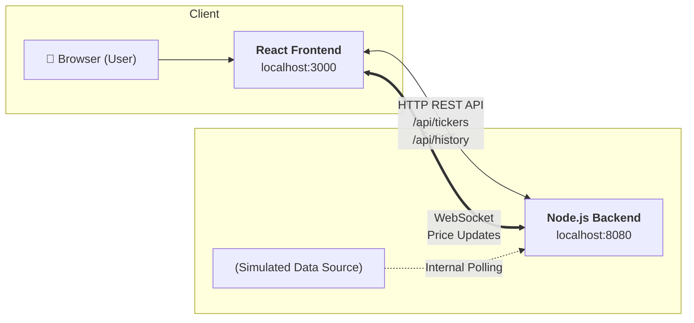

## 🏗️ Architecture & Design

The application follows a microservices-friendly architecture, with a clear separation between the frontend and backend services.

---

## Key Design Principles:

Separation of Concerns: The frontend is responsible only for presentation and user interaction. The backend handles data fetching, simulation, and real-time distribution.
Clean Code: Code is organized into logical modules with clear responsibilities. TypeScript is used on both the frontend and backend to ensure type safety and improve maintainability.
Scalability: The decoupled nature of the services allows them to be scaled independently. The use of WebSockets provides an efficient, low-latency communication channel for real-time data.

## Server Architecture

real-time-trading/
├── src/
│ ├── core/ # Business logic & domain
│ │ ├── entities/
│ │ │ └── Ticker.ts
│ │ ├── services/
│ │ │ ├── MarketDataService.ts
│ │ │ └── PriceSimulator.ts
│ │ └── types/
│ │ └── index.ts
│ ├── infrastructure/ # External services & data
│ │ ├── repositories/
│ │ │ └── TickerRepository.ts
│ │ └── config/
│ │ └── Config.ts
│ ├── api/ # HTTP endpoints
│ │ ├── controllers/
│ │ │ └── TickerController.ts
│ │ ├── middleware/
│ │ │ └── ErrorHandler.ts
│ │ └── routes/
│ │ └── index.ts
│ ├── container/ # Dependency injection
│ │ └── Container.ts
│ └── server.ts # Application entry point
├── package.json
├── tsconfig.json
└── .env
