## 🏗️ Architecture & Design

The application follows a microservices-friendly architecture, with a clear separation between the frontend and backend services.

```mermaid
graph LR
    subgraph Client
        User["👤 Browser (User)"]
        Frontend["<strong>React Frontend</strong><br/>localhost:3000"]
    end

    subgraph Server
        Backend["<strong>Node.js Backend</strong><br/>localhost:8080"]
        DataSource["(Simulated Data Source)"]
    end

    User --> Frontend

    Frontend <-->|"HTTP REST API<br/>/api/tickers<br/>/api/history"| Backend
    Frontend <==>|"WebSocket<br/>Price Updates"| Backend
    DataSource -.->|Internal Polling| Backend
```

---

## Key Design Principles:

Separation of Concerns: The frontend is responsible only for presentation and user interaction. The backend handles data fetching, simulation, and real-time distribution.
Clean Code: Code is organized into logical modules with clear responsibilities. TypeScript is used on both the frontend and backend to ensure type safety and improve maintainability.
Scalability: The decoupled nature of the services allows them to be scaled independently. The use of WebSockets provides an efficient, low-latency communication channel for real-time data.
